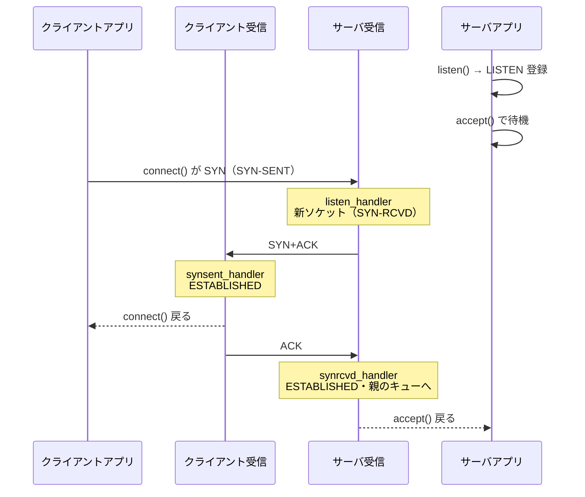
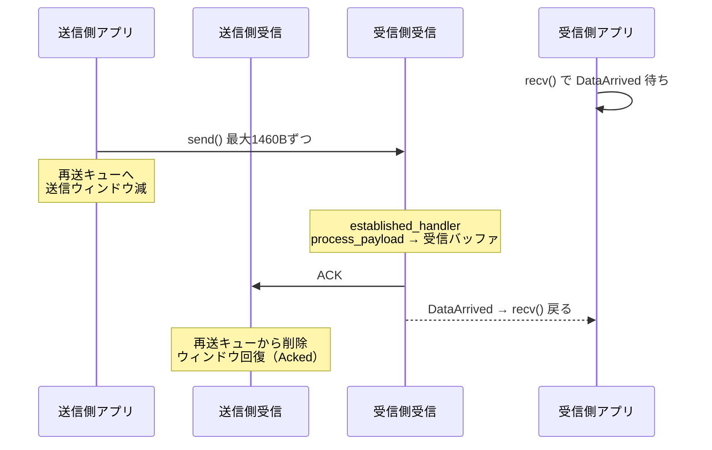
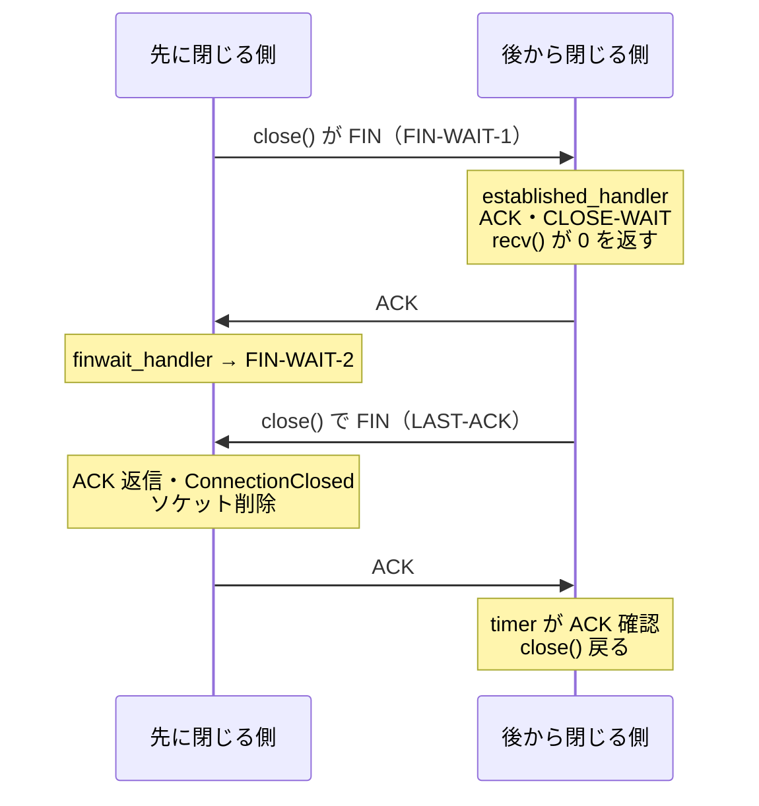
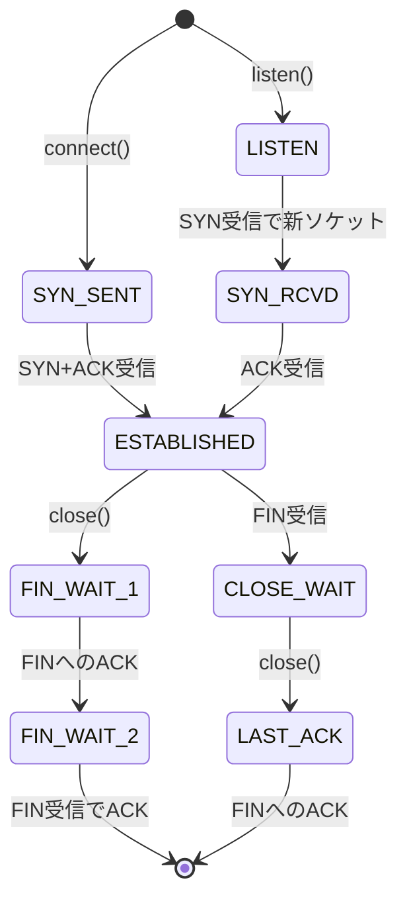

# toytcp 読解マップ

Rust / pnet / 約1000行

<div class="opacity-60 mt-8">生ソケットの上に TCP を自作したライブラリ（teru01/toytcp）を読む</div>

---

# 30秒で説明

- OS の TCP を使わない
- TCP ヘッダを自前で組み立て、生ソケットで送信
- 届いたパケットも自前で解釈
- 中身 = **3本のスレッド** + **1つのソケット表**
- スレッド間の待ち合わせ = イベント通知

---

# TCP は自作されているのか？

<div class="grid grid-cols-2 gap-6">

<div>

### 標準ライブラリ版（自作ではない）

```rust
// ~/echoserver：TCP の処理は OS 任せ
let listener = TcpListener::bind("0.0.0.0:8080")?;
for stream in listener.incoming() {
    // ...
}
```

</div>

<div>

### toytcp（自作）

```rust
// ~/toytcp：TCP の処理は自前
let tcp = TCP::new();
let listening_socket = tcp.listen(local_addr, local_port)?;
let connected_socket = tcp.accept(listening_socket)?;
```

</div>

</div>

- `pnet` で生ソケットを開き、TCP ヘッダを自分で組み立てる
- ハンドシェイク・送受信・再送・切断・チェックサムまで自前

---

# コードの規模

全体 **1180 行** = 実装 `src/` 1021 行 + 使用例 `examples/` 159 行（空行・コメント込み）

| ファイル | 行数 | 役割 |
|---|---|---|
| `src/tcp.rs` | 658 | 本体。API・受信/タイマースレッド・ハンドラ・イベント |
| `src/socket.rs` | 179 | `SockID` / `Socket` / 状態。`send_tcp_packet` |
| `src/packet.rs` | 142 | `TCPPacket`。getter / setter・チェックサム |
| `src/tcpflags.rs` | 38 | SYN / ACK / FIN のビット定義 |
| `src/lib.rs` | 4 | 公開のみ |

---

# 全体の構造

| 層 | 役割 | 場所 |
|---|---|---|
| アプリ | エコーサーバなど | `examples/*.rs` |
| TCP | API + 受信処理。ソケット表を持つ | `src/tcp.rs` |
| Socket | 1接続分。シーケンス番号・バッファ・再送キュー | `src/socket.rs` |
| TCPPacket | ヘッダ読み書き・チェックサム | `src/packet.rs` |
| 生ソケット | パケットの出入口 | `pnet::transport` |

<div class="mt-4 text-sm opacity-70">

OS の TCP が RST を返すため、`setup.sh` で iptables により RST を破棄

</div>

---

# 入口：アプリから見た toytcp

`examples/echoserver.rs`（抜粋）

```rust {2,5,10,14,17}
fn echo_server(local_addr: Ipv4Addr, local_port: u16) -> Result<()> {
    let tcp = TCP::new();                                   // スレッド起動
    let listening_socket = tcp.listen(local_addr, local_port)?;
    loop {
        let connected_socket = tcp.accept(listening_socket)?; // 接続完了まで待つ
        let cloned_tcp = tcp.clone();
        std::thread::spawn(move || {
            let mut buffer = [0; 1024];
            loop {
                let nbytes = cloned_tcp.recv(connected_socket, &mut buffer).unwrap();
                if nbytes == 0 {                            // 0 = 相手が閉じた
                    cloned_tcp.close(connected_socket).unwrap();
                    return;
                }
                cloned_tcp.send(connected_socket, &buffer[..nbytes]).unwrap();
            }
        });
    }
}
```

OS の TCP とほぼ同じ形：`listen` → `accept` → `recv` / `send` → `close`

---

# 3本のスレッド

<div class="grid grid-cols-3 gap-4 mt-6">

<div class="p-4 rounded border border-purple-400">

### アプリ
- `connect` / `accept`
- `send` / `recv` / `close`
- 送信後は `wait_event` で待機

</div>

<div class="p-4 rounded border border-cyan-500">

### 受信
- `receive_handler` がループ
- 状態ごとのハンドラへ振り分け
- `publish_event` でアプリを起こす

</div>

<div class="p-4 rounded border border-amber-500">

### タイマー
- `timer` が100msごとに巡回
- 3秒 ACK なしのパケットを再送

</div>

</div>

<div class="mt-6 text-sm opacity-70">受信・タイマーは `TCP::new()`（tcp.rs:48）で起動</div>

---

# 3本のスレッド：コード

`TCP::new()`（tcp.rs:48）

```rust {6-9,10-13}
pub fn new() -> Arc<Self> {
    let tcp = Arc::new(Self {
        sockets: RwLock::new(HashMap::new()),   // ソケット表
        event_condvar: (Mutex::new(None), Condvar::new()),
    });
    let cloned_tcp = tcp.clone();
    std::thread::spawn(move || {
        cloned_tcp.receive_handler().unwrap();  // 受信スレッド
    });
    let cloned_tcp = tcp.clone();
    std::thread::spawn(move || {
        cloned_tcp.timer();                     // タイマースレッド
    });
    tcp                                         // 呼び出し元 = アプリスレッド
}
```

- `Arc` + `clone()` = 同じ `TCP` を3本で共有

---

# 中心になるデータ

```rust
pub struct TCP {
    sockets: RwLock<HashMap<SockID, Socket>>,          // 全接続の一覧
    event_condvar: (Mutex<Option<TCPEvent>>, Condvar), // スレッド間の通知
}
```

| 名前 | 中身 | 役割 |
|---|---|---|
| `TCP` | `sockets` + `event_condvar` | 司令塔。3スレッドで共有 |
| `sockets` | `RwLock<HashMap<SockID, Socket>>` | 全接続の一覧。使用時はロック |
| `SockID` | 自IP・相手IP・自ポート・相手ポート | 接続の名前。表のキー |
| `Socket` | 送受信パラメータ・状態・バッファ・再送キュー | 1接続分 |
| `TCPEvent` | `SockID` + `kind` | スレッド間の通知 |

- イベント種別 = `ConnectionCompleted` / `Acked` / `DataArrived` / `ConnectionClosed`

---

# SockID と Socket の違い

<div class="grid grid-cols-2 gap-6">

<div>

### SockID = 接続の「名前」

```rust
#[derive(Debug, Hash, Eq, PartialEq, Clone, Copy)]
pub struct SockID(
    pub Ipv4Addr,  // 自分のIP
    pub Ipv4Addr,  // 相手のIP
    pub u16,       // 自分のポート
    pub u16,       // 相手のポート
);
```

- 4つだけ。**電話番号**

</div>

<div>

### Socket = 接続の「中身」

```rust
pub struct Socket {
    pub local_addr: Ipv4Addr,
    pub remote_addr: Ipv4Addr,
    pub local_port: u16,
    pub remote_port: u16,
    pub send_param: SendParam,
    pub recv_param: RecvParam,
    pub status: TcpStatus,
    pub recv_buffer: Vec<u8>,
    // ...再送キューなど
    pub sender: TransportSender,
}
```

- TCP を動かす情報すべて。**通話そのもの**

</div>

</div>

---

# `#[derive(...)]` とタプル構造体

- `SockID(Ipv4Addr, Ipv4Addr, u16, u16)` = **タプル構造体**。名前なし、`.0`〜`.3` で取り出す
- `derive` = 機能を自動で付けてもらう書き方

| 機能 | 必要な理由 |
|---|---|
| `Hash` / `Eq` / `PartialEq` | HashMap のキーにするため（必須） |
| `Copy` / `Clone` | 関数に何度渡しても使える（所有権のルール） |
| `Debug` | `dbg!` で表示 |

```rust
pub struct Socket {   // derive なし
    // ...
    pub sender: TransportSender,   // 比較もコピーもできない
}
```

→ **Socket は HashMap のキーにできない**。だからキー用の小さな SockID を別に用意

---

# Socket の残りのフィールド

「その接続が今どうなっているか」

| フィールド | 役割 |
|---|---|
| `send_param` | 送る側の進み具合。未ACKの番号・次に送る番号・相手の受信可能量・初期番号 |
| `recv_param` | 受ける側の進み具合。次に受け取る番号・自分の空き容量・相手の初期番号・最後尾 |
| `status` | LISTEN / ESTABLISHED など。届いたパケットの処理方法を決める |
| `recv_buffer` | アプリが `recv()` で読むまで貯める場所 |
| `retransmission_queue` | ACK が来るまで送信済みパケットを保持。来なければ再送 |
| `connected_connection_queue` | リスニングソケット専用。接続完了した SockID を並べ、`accept()` が取り出す |
| `listening_socket` | 接続済みソケット専用。親（リスニングソケット）の SockID |
| `sender` | 実際に送る生ソケット |

---

# 疑問：アドレスが重複していない？

```rust {2-7|9-10}
// socket.rs：Socket の中身から SockID を作る
pub fn get_sock_id(&self) -> SockID {
    SockID(self.local_addr, self.remote_addr,
           self.local_port, self.remote_port)
}

// tcp.rs listen()：キーと値の両方に同じアドレス
let sock_id = socket.get_sock_id();
lock.insert(sock_id, socket);
```

- 重複の場所 = **HashMap のキー（SockID）と値（Socket）の間**
- Socket がアドレスを持つ理由：ハンドラは Socket だけを受け取り、`send_tcp_packet` は自分のアドレスでヘッダを作る
- リスク = 片方だけ書き換えると食い違う → 登録後に書き換えないので実害なし

---

# まとめれば一元管理できる？

- Socket に `sock_id: SockID` を1つ持たせる → **Socket の中**は1か所になる
- ただし **HashMap のキーの分は残る**
  - `insert(キー, 値)` はキーと値を別々に保存する仕組み
  - ロッカーの扉の番号（キー）と、荷物の名札（Socket 内のアドレス）
- タプル型が原因ではない
  - まとめると `socket.sock_id.3` になって読みにくいだけ
  - 名前付きフィールドにすれば解決

---

# 実際に書き直した（sockid-refactor）

```diff
-pub struct SockID(pub Ipv4Addr, pub Ipv4Addr, pub u16, pub u16);
-
-pub struct Socket {
+pub struct SockID {
     pub local_addr: Ipv4Addr,
     pub remote_addr: Ipv4Addr,
     pub local_port: u16,
     pub remote_port: u16,
+}
+
+pub struct Socket {
+    pub sock_id: SockID,
     pub send_param: SendParam,
```

```diff
-        tcp_packet.set_src(self.local_port);
+        tcp_packet.set_src(self.sock_id.local_port);
```

- `pnet 0.27` は今の Rust でビルド不可 → `0.35` へ（コード修正なし）

---

# 書き直した結果

- host1 エコーサーバ ⇔ host2 クライアント：**前後とも疎通 OK**（`hello` / `toytcp test`）
- `lock.insert(sock_id, socket)` は残る → キーとの重複は消えない
  - 同じ値が2か所にあるだけで、どちらも正しい → 動作に影響なし
- コードは約18行**増加**（`socket.remote_addr` → `socket.sock_id.remote_addr`）

| 元の書き方 | 書き直し |
|---|---|
| 短さ・手軽さ | データのまとまり・読みやすさ |

→ どちらが良いかはトレードオフ

<div class="mt-4 text-sm opacity-60">

`setup.sh` の modified は実行権限（`chmod +x`）だけの変更。書き直しとは無関係なのでコミット対象外

</div>

---

# 流れ1：接続（3ウェイハンドシェイク）



---

# listen_handler：SYN を受けたサーバ

tcp.rs:397（抜粋）

```rust {all|1-3|4-6|7-8|9|10-13|14-15}
if packet.get_flag() & tcpflags::ACK > 0 {
    return Ok(());                       // 1. 本来は RST を返す（省略）
}
if packet.get_flag() & tcpflags::SYN > 0 {
    let mut connection_socket = Socket::new(      // 2. 新しいソケットを作る
        listening_socket.local_addr, remote_addr,
        listening_socket.local_port, packet.get_src(), TcpStatus::SynRcvd)?;
    connection_socket.recv_param.next = packet.get_seq() + 1; // 3. SYN は番号を1消費
    connection_socket.send_param.initial_seq = rand::thread_rng().gen_range(1..1 << 31); // 4. ランダム
    connection_socket.send_tcp_packet(
        connection_socket.send_param.initial_seq,
        connection_socket.recv_param.next,
        tcpflags::SYN | tcpflags::ACK, &[])?;     // 5. SYN+ACK を返す
    connection_socket.listening_socket = Some(listening_socket.get_sock_id()); // 6. 親を記憶
    table.insert(connection_socket.get_sock_id(), connection_socket);          //    表に登録
}
```

- **リスニングソケット自体は接続に使わない**。ずっと LISTEN のまま次を待つ

---

# 接続完了 → accept() が返る

<div class="grid grid-cols-2 gap-6">

<div>

### synrcvd_handler（受信スレッド）

```rust
socket.status = TcpStatus::Established;
if let Some(id) = socket.listening_socket {
    let ls = table.get_mut(&id).unwrap();
    ls.connected_connection_queue
      .push_back(sock_id);     // 親のキューへ
    self.publish_event(
        ls.get_sock_id(),
        TCPEventKind::ConnectionCompleted);
}
```

</div>

<div>

### accept（アプリスレッド）

```rust
pub fn accept(&self, sock_id: SockID)
    -> Result<SockID> {
    self.wait_event(sock_id,   // 起こされるまで待つ
        TCPEventKind::ConnectionCompleted);
    let mut table = self.sockets.write().unwrap();
    Ok(table.get_mut(&sock_id)
        .context("no such socket")?
        .connected_connection_queue
        .pop_front()           // キューから取り出す
        .context("no connected socket")?)
}
```

</div>

</div>

- 受信スレッドが `publish_event` → アプリスレッドの `wait_event` が起きる

---

# 流れ2：データの送受信



---

# send：分割して送る

tcp.rs:225（抜粋）

```rust {3-4|5-9|10-12}
while cursor < buffer.len() {
    // ...ロック取得・socket 取り出し
    let mut send_size = cmp::min(MSS,
        cmp::min(socket.send_param.window as usize, buffer.len() - cursor));
    while send_size == 0 {                  // ウィンドウ 0
        drop(table);                        // ロックを外して
        self.wait_event(sock_id, TCPEventKind::Acked); // ACK を待つ
        // ...ロック再取得・send_size 再計算
    }
    socket.send_tcp_packet(socket.send_param.next, socket.recv_param.next,
                           tcpflags::ACK, &buffer[cursor..cursor + send_size])?;
    cursor += send_size;
    socket.send_param.next += send_size as u32;
    socket.send_param.window -= send_size as u16;
}
```

- 切り出し = min(MSS 1460B, 送信ウィンドウ, 残りデータ)

---

# recv：届くまで待って読む

tcp.rs:194（抜粋）

```rust {1|2-8|9-12}
let mut received_size = socket.recv_buffer.len() - socket.recv_param.window as usize;
while received_size == 0 {
    match socket.status {                   // FIN 受信済みなら抜ける → 0 を返す
        TcpStatus::CloseWait | TcpStatus::LastAck | TcpStatus::TimeWait => break,
        _ => {}
    }
    drop(table);
    self.wait_event(sock_id, TCPEventKind::DataArrived);
    // ...ロック再取得・received_size 再計算
}
let copy_size = cmp::min(buffer.len(), received_size);
buffer[..copy_size].copy_from_slice(&socket.recv_buffer[..copy_size]);
socket.recv_buffer.copy_within(copy_size.., 0);   // 前に詰める
socket.recv_param.window += copy_size as u16;     // 読んだ分ウィンドウが空く
```

- 受信バッファ 4380B。`process_payload` が書き込み、`recv()` が読み出す

---

# send_tcp_packet：ヘッダを自前で組み立てる

socket.rs:133（抜粋）

```rust {2-8|9-11|12-13|14-17}
let mut tcp_packet = TCPPacket::new(payload.len());
tcp_packet.set_src(self.local_port);
tcp_packet.set_dest(self.remote_port);
tcp_packet.set_seq(seq);
tcp_packet.set_ack(ack);
tcp_packet.set_flag(flag);
tcp_packet.set_window_size(self.recv_param.window);
tcp_packet.set_payload(payload);
tcp_packet.set_checksum(util::ipv4_checksum(&tcp_packet.packet(), 8, &[],
    &self.local_addr, &self.remote_addr, IpNextHeaderProtocols::Tcp));
let sent_size = self.sender
    .send_to(tcp_packet.clone(), IpAddr::V4(self.remote_addr)).context("failed to send")?; // 生ソケットで送信
if payload.is_empty() && tcp_packet.get_flag() == tcpflags::ACK {
    return Ok(sent_size);                   // データなし ACK は再送しない
}
self.retransmission_queue.push_back(RetransmissionQueueEntry::new(tcp_packet));
```

---

# 流れ3：再送

- `send_tcp_packet` = データなし ACK 以外は全て再送キューへ
- `timer`（tcp.rs:69）が100msごとにキュー先頭から確認

1. ACK 済み → キューから削除・`Acked` 通知
2. 送信から3秒未満 → そこで停止
3. 3秒経過・送信回数5回未満 → 再送してキュー末尾へ
4. 合計5回で断念。FIN なら `ConnectionClosed` 通知

---

# timer：コード <span class="text-base opacity-60">tcp.rs:69（抜粋）</span>

```rust {4-7|8-11|12-17|19-20}
loop {
    let mut table = self.sockets.write().unwrap();
    for (sock_id, socket) in table.iter_mut() {
        while let Some(mut item) = socket.retransmission_queue.pop_front() {
            if socket.send_param.unacked_seq > item.packet.get_seq() {
                self.publish_event(*sock_id, TCPEventKind::Acked);
                continue;                                     // 1. ACK 済み
            }
            if item.latest_transmission_time.elapsed().unwrap() < Duration::from_secs(RETRANSMITTION_TIMEOUT) {
                socket.retransmission_queue.push_front(item);
                break;                                        // 2. まだ待つ
            }
            if item.transmission_count < MAX_TRANSMITTION {
                socket.sender.send_to(item.packet.clone(), IpAddr::V4(socket.remote_addr)).unwrap();
                item.transmission_count += 1;
                socket.retransmission_queue.push_back(item);
                break;                                        // 3. 再送
            } // else 4. 断念
        }
    }
    drop(table);
    thread::sleep(Duration::from_millis(100));
}
```

---

# 流れ4：切断



- `recv()` が 0 = 相手が閉じた合図

---

# 状態遷移



---

# receive_handler：状態で振り分け

tcp.rs:327（抜粋）

```rust {1-3|4-7|8-10|11-17}
let socket = match table.get_mut(&SockID(local_addr, remote_addr,
                                         packet.get_dest(), packet.get_src())) {
    Some(socket) => socket,                        // 接続済みソケット
    None => match table.get_mut(&SockID(local_addr, UNDETERMINED_IP_ADDR,
                                        packet.get_dest(), UNDETERMINED_PORT)) {
        Some(socket) => socket,                    // リスニングソケット
        None => continue,                          // 該当なしは無視
    },
};
if !packet.is_correct_checksum(local_addr, remote_addr) { continue; }
match socket.status {
    TcpStatus::Listen      => self.listen_handler(table, sock_id, &packet, remote_addr),
    TcpStatus::SynRcvd     => self.synrcvd_handler(table, sock_id, &packet),
    TcpStatus::SynSent     => self.synsent_handler(socket, &packet),
    TcpStatus::Established => self.established_handler(socket, &packet),
    TcpStatus::CloseWait | TcpStatus::LastAck => self.close_handler(socket, &packet),
    TcpStatus::FinWait1 | TcpStatus::FinWait2 => self.finwait_handler(socket, &packet),
    // ...
}
```

---

# 状態と担当関数

| 状態 | 関数 | 主な仕事 |
|---|---|---|
| LISTEN | `listen_handler` | SYN → 新ソケット・SYN+ACK |
| SYN-SENT | `synsent_handler` | SYN+ACK → ACK・ESTABLISHED |
| SYN-RCVD | `synrcvd_handler` | ACK → ESTABLISHED・親キューへ |
| ESTABLISHED | `established_handler` | ACK処理・データ受取・FIN → CLOSE-WAIT |
| FIN-WAIT-1/2 | `finwait_handler` | FIN の ACK・切断完了 |
| CLOSE-WAIT / LAST-ACK | `close_handler` | ACK番号の記録のみ |

---

# イベント通知：wait_event / publish_event

<div class="grid grid-cols-2 gap-6">

<div>

### 待つ側（アプリ）tcp.rs:310

```rust
let (lock, cvar) = &self.event_condvar;
let mut event = lock.lock().unwrap();
loop {
    if let Some(ref e) = *event {
        if e.sock_id == sock_id && e.kind == kind {
            break;          // 自分宛てなら起きる
        }
    }
    event = cvar.wait(event).unwrap(); // 眠る
}
*event = None;
```

</div>

<div>

### 起こす側（受信・タイマー）tcp.rs:632

```rust
let (lock, cvar) = &self.event_condvar;
let mut e = lock.lock().unwrap();
*e = Some(TCPEvent::new(sock_id, kind));
cvar.notify_all();          // 全員起こす
```

</div>

</div>

- 置き場は `Option<TCPEvent>` **1つだけ** → 同時発生で上書きの可能性

---

# 関数：アプリ向け API

| 関数 | 位置 | 処理 |
|---|---|---|
| `listen` | tcp.rs:130 | LISTEN ソケットを表に登録。送信なし |
| `accept` | tcp.rs:145 | `ConnectionCompleted` 待ち → キューから取得 |
| `connect` | tcp.rs:170 | 送信元IP・ポート決定 → SYN送信 → 完了待ち |
| `send` | tcp.rs:225 | 分割送信。ウィンドウ 0 なら `Acked` 待ち |
| `recv` | tcp.rs:194 | 溜まり量 0 なら `DataArrived` 待ち。FIN なら 0 |
| `close` | tcp.rs:270 | FIN+ACK → `ConnectionClosed` 待ち → 削除 |

---

# 関数：受信・下支え

| 関数 | 位置 | 処理 |
|---|---|---|
| `receive_handler` | tcp.rs:327 | IPパケット受信 → ソケット探索 → チェックサム → 振り分け |
| `process_payload` | tcp.rs:552 | 受信バッファへ配置・順序通りなら `next` 進行・ACK |
| `timer` | tcp.rs:69 | 再送管理 |
| `delete_acked_segment_from_retransmission_queue` | tcp.rs:502 | ACK 済み削除・ウィンドウ回復 |
| `send_tcp_packet` | socket.rs:133 | ヘッダ組立・チェックサム・送信・再送キュー |
| `wait_event` / `publish_event` | tcp.rs:310 / 632 | Condvar による待ち合わせ |

---

# 省略されていること

- 異常パケットへの RST 返信なし
- TIME-WAIT / CLOSING なし。同時クローズ非対応
- 順序入れ替わりデータは `next` を進めない
- 再送タイムアウト 3秒固定。輻輳制御なし
- イベント置き場が1つ。同時発生で上書きの可能性

---

# Rust で読むときのコツ

目的は **TCP の流れをコードで確かめること**。文法の細部ではない

| 出てくるもの | 読み方 |
|---|---|
| `Arc<TCP>` / `.clone()` | 3スレッドで `TCP` を共有 |
| `sockets.write().unwrap()` | 表のロック取得。`drop(table)` で解放 |
| `drop(table)` → `wait_event` | ロック解放後に待機。しないと受信が止まる |
| `Condvar` | 起こされるまで眠る仕組み |
| `?` / `Result` | エラーは呼び出し元へ |
| `match socket.status` | 状態別の振り分け |
| `flag & tcpflags::ACK > 0` | フラグビット判定 |

---

# 読む順番

1. `examples/echoserver.rs`
2. `listen` / `accept`
3. `receive_handler`
4. 各ハンドラ
5. `send` / `recv`
6. `timer`

<div class="mt-6 opacity-70">アプリの入口 → 受信スレッドの順で、待ち合わせ箇所が見える</div>
