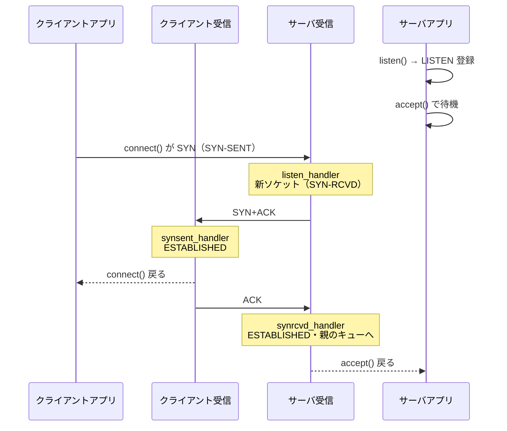
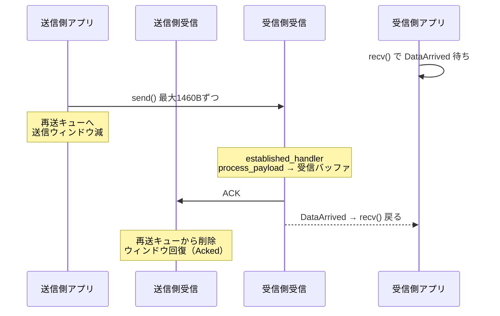
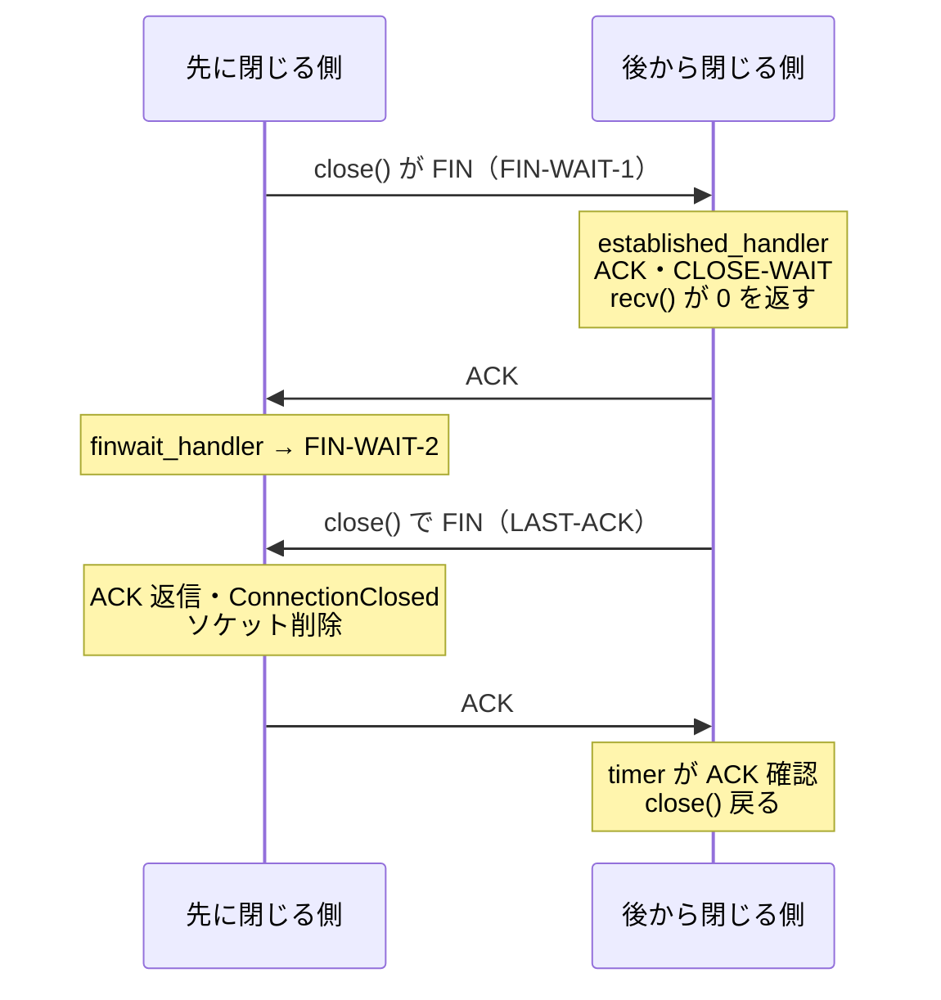
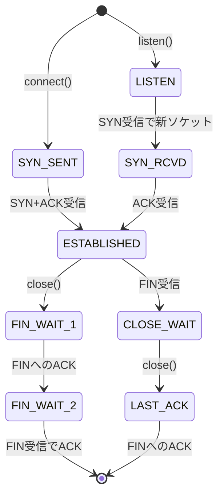

# toytcp 読解マップ

Rust / pnet / 約1000行

生ソケットの上に TCP を自作したライブラリ

---

# 30秒で説明

- OS の TCP を使わない
- TCP ヘッダを自前で組み立て、生ソケットで送信
- 届いたパケットも自前で解釈
- 中身 = **3本のスレッド** + **1つのソケット表**
- スレッド間の待ち合わせ = イベント通知

---

# 全体の構造

| 層 | 役割 | 場所 |
|---|---|---|
| アプリ | エコーサーバなど | `examples/*.rs` |
| TCP | API + 受信処理。ソケット表を持つ | `src/tcp.rs` |
| Socket | 1接続分。シーケンス番号・バッファ・再送キュー | `src/socket.rs` |
| TCPPacket | ヘッダ読み書き・チェックサム | `src/packet.rs` |
| 生ソケット | パケットの出入口 | `pnet::transport` |

OS の TCP が RST を返すため、`setup.sh` で iptables により RST を破棄

---

# ファイルの役割

| ファイル | 行数 | 役割 |
|---|---|---|
| `src/tcp.rs` | 658 | 本体。API・受信/タイマースレッド・ハンドラ・イベント |
| `src/socket.rs` | 179 | `SockID` / `Socket` / 状態。`send_tcp_packet` |
| `src/packet.rs` | 142 | `TCPPacket`。getter / setter・チェックサム |
| `src/tcpflags.rs` | 38 | SYN / ACK / FIN のビット定義 |
| `src/lib.rs` | 4 | 公開のみ |

---

# 3本のスレッド

### アプリ
- `connect` / `accept`
- `send` / `recv` / `close`
- 送信後は `wait_event` で待機

### 受信
- `receive_handler` がループ
- 状態ごとのハンドラへ振り分け
- `publish_event` でアプリを起こす

### タイマー
- `timer` が100msごとに巡回
- 3秒 ACK なしのパケットを再送

受信・タイマーは `TCP::new()`（tcp.rs:48）で起動

---

# 中心になるデータ

| 名前 | 中身 | 役割 |
|---|---|---|
| `TCP` | `sockets` + `event_condvar` | 司令塔。3スレッドで共有 |
| `sockets` | `RwLock<HashMap<SockID, Socket>>` | 全接続の一覧。使用時はロック |
| `SockID` | 自IP・相手IP・自ポート・相手ポート | 接続の名前。表のキー |
| `Socket` | 送受信パラメータ・状態・バッファ・再送キュー | 1接続分 |
| `TCPEvent` | `SockID` + `kind` | スレッド間の通知 |

- イベント種別 = `ConnectionCompleted` / `Acked` / `DataArrived` / `ConnectionClosed`

---

# 流れ1：接続（3ウェイハンドシェイク）

---

# 接続のポイント

- リスニングソケット = **ずっと LISTEN のまま**
- 接続ごとに新ソケットを作成
- 新ソケットは親の `SockID` を `listening_socket` に保持
- 完了したら親の `connected_connection_queue` に自分を追加
- `accept()` = キューから1つ取り出して返す

---

# 流れ2：データの送受信

---

# 送信・受信の仕様

- **送る側**
  - 切り出し = min(MSS 1460B, 送信ウィンドウ, 残りデータ)
  - ウィンドウ 0 → `Acked` を待つ
- **受ける側**
  - `process_payload` が受信バッファ（4380B）へ書き込み
  - 受信ウィンドウ減 → ACK 返信
  - `recv()` で読むとウィンドウが空く

---

# 流れ3：再送

- `send_tcp_packet`（socket.rs:133）
  - データなし ACK 以外は全て再送キューへ
- `timer`（tcp.rs:69）が100msごとにキュー先頭から確認

1. ACK 済み → キューから削除・`Acked` 通知
2. 送信から3秒未満 → そこで停止
3. 3秒経過・送信回数5回未満 → 再送してキュー末尾へ
4. 合計5回で断念。FIN なら `ConnectionClosed` 通知

---

# 流れ4：切断

- `recv()` が 0 = 相手が閉じた合図

---

# 状態遷移

---

# 状態と担当関数

`receive_handler`（tcp.rs:379）の `match` で振り分け

| 状態 | 関数 | 主な仕事 |
|---|---|---|
| LISTEN | `listen_handler` | SYN → 新ソケット・SYN+ACK |
| SYN-SENT | `synsent_handler` | SYN+ACK → ACK・ESTABLISHED |
| SYN-RCVD | `synrcvd_handler` | ACK → ESTABLISHED・親キューへ |
| ESTABLISHED | `established_handler` | ACK処理・データ受取・FIN → CLOSE-WAIT |
| FIN-WAIT-1/2 | `finwait_handler` | FIN の ACK・切断完了 |
| CLOSE-WAIT / LAST-ACK | `close_handler` | ACK番号の記録のみ |

---

# 関数：アプリ向け API

| 関数 | 位置 | 処理 |
|---|---|---|
| `listen` | tcp.rs:130 | LISTEN ソケットを表に登録。送信なし |
| `accept` | tcp.rs:145 | `ConnectionCompleted` 待ち → キューから取得 |
| `connect` | tcp.rs:170 | 送信元IP・ポート決定 → SYN送信 → 完了待ち |
| `send` | tcp.rs:225 | 分割送信。ウィンドウ 0 なら `Acked` 待ち |
| `recv` | tcp.rs:194 | 溜まり量 0 なら `DataArrived` 待ち。FIN なら 0 |
| `close` | tcp.rs:270 | FIN+ACK → `ConnectionClosed` 待ち → 削除 |

---

# 関数：受信・下支え

| 関数 | 位置 | 処理 |
|---|---|---|
| `receive_handler` | tcp.rs:327 | IPパケット受信 → ソケット探索 → チェックサム → 振り分け |
| `process_payload` | tcp.rs:552 | 受信バッファへ配置・順序通りなら `next` 進行・ACK |
| `timer` | tcp.rs:69 | 再送管理 |
| `delete_acked_segment_from_retransmission_queue` | tcp.rs:502 | ACK 済み削除・ウィンドウ回復 |
| `send_tcp_packet` | socket.rs:133 | ヘッダ組立・チェックサム・送信・再送キュー |
| `wait_event` / `publish_event` | tcp.rs:310 / 632 | Condvar による待ち合わせ |

---

# 省略されていること

- 異常パケットへの RST 返信なし
- TIME-WAIT / CLOSING なし。同時クローズ非対応
- 順序入れ替わりデータは `next` を進めない
- 再送タイムアウト 3秒固定。輻輳制御なし
- イベント置き場が1つ。同時発生で上書きの可能性

---

# Rust で読むときのコツ

| 出てくるもの | 読み方 |
|---|---|
| `Arc<TCP>` / `.clone()` | 3スレッドで `TCP` を共有 |
| `sockets.write().unwrap()` | 表のロック取得。`drop(table)` で解放 |
| `drop(table)` → `wait_event` | ロック解放後に待機。しないと受信が止まる |
| `Condvar` | 起こされるまで眠る仕組み |
| `?` / `Result` | エラーは呼び出し元へ |
| `match socket.status` | 状態別の振り分け |
| `flag & tcpflags::ACK > 0` | フラグビット判定 |

---

# 読む順番

1. `examples/echoserver.rs`
2. `listen` / `accept`
3. `receive_handler`
4. 各ハンドラ
5. `send` / `recv`
6. `timer`

アプリの入口 → 受信スレッドの順で、待ち合わせ箇所が見える

